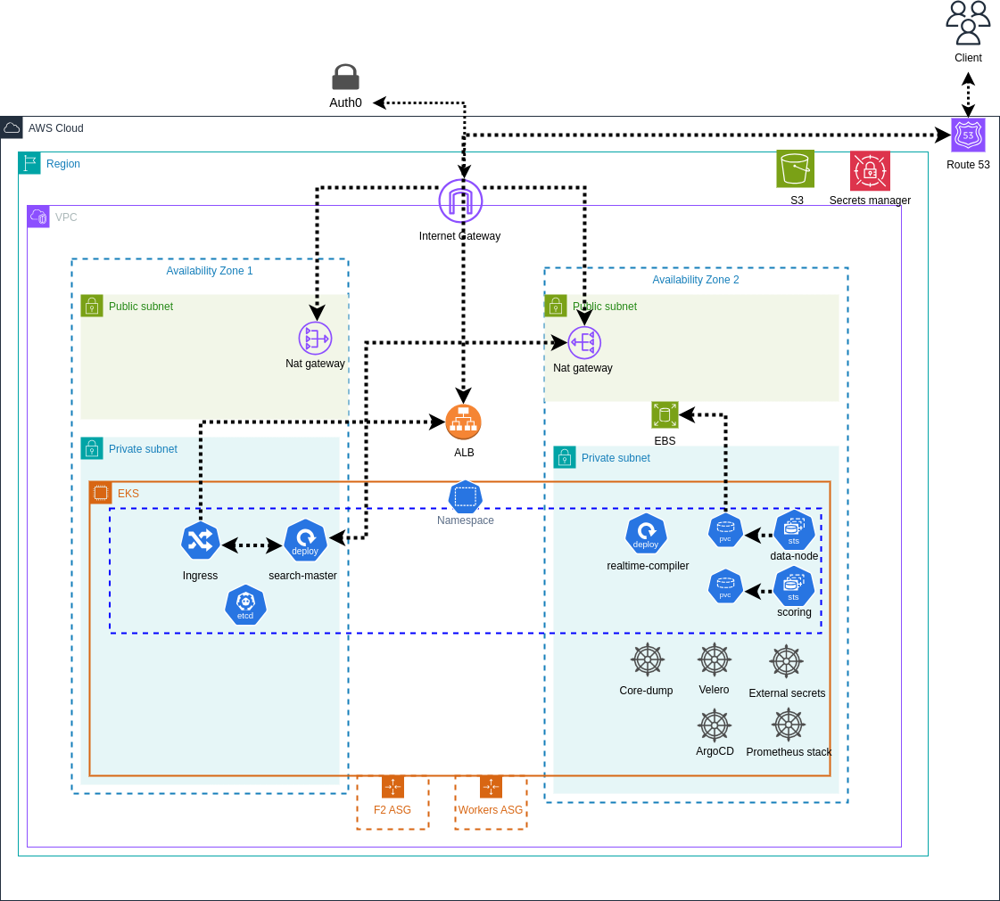

# Hyperspace Terraform Module



## Table of Contents
- [Overview](#overview)
- [Prerequisites](#prerequisites)
- [Basic Module Usage](#basic-module-usage)
- [Inputs](#inputs)
  - [Required Inputs](#required-inputs)
  - [Optional Inputs](#optional-inputs)
    - [VPC Configuration](#vpc-configuration)
    - [EKS Configuration](#eks-configuration)
    - [Monitoring and Observability](#monitoring-and-observability)
    - [Additional Configuration](#additional-configuration)
  - [Object Inputs](#object-inputs)
- [VPC Examples](#vpc-examples)
  - [Option 1: Create New VPC (Default)](#option-1-create-new-vpc-default)
  - [Option 2: Use Existing VPC](#option-2-use-existing-vpc)
    - [Prerequisites for Existing VPC](#prerequisites-for-existing-vpc)
- [Features](#features)
- [Important Notes](#important-notes)
  - [ACM Certificate Validation](#acm-certificate-validation)
  - [Privatelink](#privatelink)
- [Access Your Infrastructure](#access-your-infrastructure)

## Overview

This Terraform module provides a complete infrastructure setup for Hyperspace. It creates everything needed to run Hyperspace in your AWS account.

The module creates a production-ready infrastructure with:

- Amazon EKS cluster with managed and self-managed node groups
- VPC with public and private subnets (Optional: deployment into an existing VPC)
- AWS Load Balancer Controller
- Internal and external ingress controllers
- Monitoring stack (Prometheus, Grafana, Loki)
- Backup solution (Velero)
- [GitOps with ArgoCD](https://github.com/hyper-space-io/Hyperspace-Deployment)

After deploying this Terraform Module, Install The Hyperspace Helm Chart through ArgoCD using the [Hyperspace Deployment Repository](https://github.com/hyper-space-io/Hyperspace-Deployment)

## Prerequisites

- Terraform >= 1.5.0
- AWS CLI configured with admin access
- kubectl installed
- Helm 3.x
- AWS account with admin access
- Domain name (for Route53 setup)

## Basic Module Usage

1. Create a new Terraform configuration and call the module as follows:

```hcl
module "hyperspace" {
  source                = "github.com/hyper-space-io/Hyperspace-terraform-module"
  aws_region            = "REGION"
  domain_name           = "DOMAIN.com"
  environment           = "ENVIRONMENT"
  vpc_cidr              = "10.50.0.0/16"
  aws_account_id        = "AWS_ACCOUNT_ID"
  hyperspace_account_id = "HYPERSPACE_ACCOUNT_ID"

  argocd_config = {
    vcs = {
      organization = "<org>"
      repository   = "<repo>"
      gitlab/github = {
        enabled = true
      }
    }
  }
}
```

2. Initialize and apply the Terraform configuration:
```bash
terraform init 
terraform apply
```

3. After the infrastructure is deployed, you can install Hyperspace Helm chart through [Hyperspace Deployment Repository](https://github.com/hyper-space-io/Hyperspace-Deployment)

## Inputs

### Required Inputs

| Name | Description | Type | Default | Required |
|------|-------------|------|---------|----------|
| aws_account_id | The AWS account ID where resources will be created | `string` | n/a | yes |
| hyperspace_account_id | The Hyperspace account ID (obtained from Hyperspace support) used for accessing Hyperspace resources | `string` | n/a | yes |
| aws_region | The AWS region where resources will be created | `string` | `"us-east-1"` | yes |
| domain_name | The main domain name used for creating subdomains for various services | `string` | `""` | yes |
| environment | The deployment environment (e.g., dev, staging, prod) | `string` | n/a | yes |
| argocd_config | Configuration for ArgoCD installation and VCS integration | `object` | [See below](#argocd_config-required) | yes |

### Optional Inputs

#### Global Configuration

| Name | Description | Type | Default | Required |
|------|-------------|------|---------|----------|
| terraform_role | IAM role for Terraform to assume | `string` | `null` | no |
| project | Name of the project | `string` | `"hyperspace"` | no |
| tags | Map of tags to add to all resources | `map(string)` | `{}` | no |

#### VPC Configuration

| Name | Description | Type | Default | Required |
|------|-------------|------|---------|----------|
| vpc_cidr | The CIDR block for the VPC | `string` | `"10.0.0.0/16"` | no |
| existing_vpc_id | ID of an existing VPC to use | `string` | `null` | no |
| existing_private_subnets | List of existing private subnet IDs | `list(string)` | `null` | no |
| availability_zones | List of availability zones to deploy resources | `list(string)` | `[]` | no |
| num_zones | Number of availability zones to use for EKS nodes | `number` | `2` | no |
| enable_nat_gateway | Whether to enable NAT Gateway | `bool` | `true` | no |
| single_nat_gateway | Whether to use a single NAT Gateway or one per AZ | `bool` | `false` | no |
| create_vpc_flow_logs | Whether to enable VPC flow logs | `bool` | `false` | no |
| flow_logs_retention | Number of days to retain VPC flow logs | `number` | `14` | no |
| flow_log_group_class | CloudWatch log group class for flow logs | `string` | `"STANDARD"` | no |
| flow_log_file_format | Format for VPC flow logs | `string` | `"parquet"` | no |

#### EKS Configuration

| Name | Description | Type | Default | Required |
|------|-------------|------|---------|----------|
| create_eks | Whether to create the EKS cluster | `bool` | `true` | no |
| cluster_endpoint_public_access | Whether to enable public access to the EKS cluster endpoint | `bool` | `false` | no |
| enable_cluster_autoscaler | Whether to enable and install cluster-autoscaler | `bool` | `true` | no |
| worker_nodes_max | Maximum number of worker nodes allowed | `number` | `10` | no |
| worker_instance_type | Instance type(s) for EKS worker nodes | `list(string)` | `["m5n.xlarge"]` | no |
| eks_additional_admin_roles | Additional IAM roles to add as cluster administrators | `list(string)` | `[]` | no |
| eks_additional_admin_roles_policy | IAM policy for the EKS additional admin roles | `string` | `"AmazonEKSClusterAdminPolicy"` | no |

#### Route53 Configuration

| Name | Description | Type | Default | Required |
|------|-------------|------|---------|----------|
| create_public_zone | Whether to create the public Route 53 zone | `bool` | `false` | no |
| existing_public_zone_id | ID of an existing public Route 53 zone | `string` | `null` | no |
| existing_private_zone_id | ID of an existing private Route 53 zone | `string` | `null` | no |
| domain_validation_zone_id | ID of a public Route 53 zone to use for ACM certificate validation | `string` | `null` | no |

#### Monitoring and Observability

| Name | Description | Type | Default | Required |
|------|-------------|------|---------|----------|
| prometheus_endpoint_config | Configuration for Prometheus endpoint service | `object` | See below | no |
| grafana_privatelink_config | Configuration for Grafana PrivateLink | `object` | See below | no |

### Object Inputs

#### argocd_config (Required)

```hcl
argocd_config = {
  # Required fields
  vcs = {
    organization = string  # Your Git organization/group name
    repository   = string  # Your repository name
    # Choose either GitHub or GitLab
    github = {
      enabled = bool  # Set to true to use GitHub
    }
    # OR
    gitlab = {
      enabled = bool  # Set to true to use GitLab
    }
  }

  # Optional fields with defaults
  enabled = true
  privatelink = {
    enabled                     = false
    endpoint_allowed_principals = []
    additional_aws_regions      = []
  }
  rbac = {
    sso_admin_group        = null
    users_rbac_rules       = []
    users_additional_rules = []
  }
}
```

#### prometheus_endpoint_config

```hcl
prometheus_endpoint_config = {
  enabled                 = false
  endpoint_service_name   = ""
  endpoint_service_region = ""
  additional_cidr_blocks  = []
}
```

#### grafana_privatelink_config

```hcl
grafana_privatelink_config = {
  enabled                     = false
  endpoint_allowed_principals = []
  additional_aws_regions      = []
}
```

## VPC Examples

The module supports two deployment options for networking:

### Option 1: Create New VPC (Default)

By default, the module creates a new VPC with the following configuration:
- CIDR block: `10.0.0.0/16` (configurable via `vpc_cidr`)
- Public and private subnets across 2 availability zones
- NAT Gateway for private subnet internet access
- All required tags and DNS settings automatically configured

### Option 2: Use Existing VPC

To use an existing VPC, simply provide the VPC and subnet IDs:

```hcl
module "hyperspace" {
  source                = "github.com/hyper-space-io/Hyperspace-terraform-module"
  aws_region            = "us-east-1" 
  domain_name           = "example.com"
  environment           = "dev"
  aws_account_id        = "123456789012"
  hyperspace_account_id = "123456789012"

  # Existing VPC Configuration
  existing_vpc_id        = "vpc-0dc21447e050ee2b9"
  existing_private_subnets = [
    "subnet-063e309f79a853d4b",
    "subnet-036a1e0052df1a89f",
    "subnet-0661c345359809e05"
  ]
  argocd_config = {
    vcs = {
      organization = "your-org"
      repository   = "your-repo"
      github = {
        enabled = true
      }
    }
  }
}
```

#### Prerequisites for Existing VPC

Before using an existing VPC, ensure it meets these requirements:

1. **VPC Settings**:
   - DNS hostnames must be enabled
   - DNS resolution must be enabled

2. **Subnet Tags**:
   - Private subnets must have: 
     ```
     kubernetes.io/role/internal-elb = 1
     Type = private
     ```
   - Public subnets must have (only if external ALB is required, i.e., when `create_public_zone` is true): 
     ```
     kubernetes.io/role/elb = 1
     Type = public
     kubernetes.io/cluster/${cluster-name} = shared
     ```

3. **Kubernetes Cluster Tags**:
   If the subnets already have an existing EKS cluster, they will have:
   ```
   kubernetes.io/cluster/${cluster-name} = shared/owned
   ```
   
   You must add our EKS cluster tag as well:
   ```
   kubernetes.io/cluster/<HYPERSPACE_EKS_CLUSTER> = shared
   ```

4. **Network Requirements**:
   - Private subnets must have NAT Gateway access
   - Sufficient IP addresses in each subnet for EKS nodes

## DNS and Certificate Configuration

The module provides multiple options for managing DNS zones and ACM certificate validation:

### Option 1: Create New Zones (Default)
By default, the module:
- Creates a private hosted zone for internal services
- Does NOT create a public zone (create_public_zone = false)
- Requires manual certificate validation

### Option 2: Use Existing Zones
You can use existing Route53 zones, for records to be created and DNS Validaiton by providing their IDs:

```hcl
module "hyperspace" {
  # ... other configuration ...
  
  # Use existing zones
  existing_public_zone_id  = "Z1234567890ABC"  # Optional: ID of existing public zone
  existing_private_zone_id = "Z0987654321XYZ"  # Optional: ID of existing private zone
}
```

### Option 3: DNS Validation Only
If you want to use a public zone only for certificate validation (without creating or managing the zone):

```hcl
module "hyperspace" {
  # ... other configuration ...
  
  # Use a public zone only for certificate validation
  domain_validation_zone_id = "Z1234567890ABC"  # ID of a public zone for ACM validation
}
```

### Certificate Validation

Certificate validation is handled automatically when using any of these options:
- Using `create_public_zone = true` (creates a new public zone)
- Providing `existing_public_zone_id` (uses existing public zone)
- Providing `domain_validation_zone_id` (uses specified zone for validation only)

#### Manual Validation
If none of the above options are used, you'll need to manually validate the certificates:

1. In AWS Console > Certificate Manager, find your pending certificate
2. Copy the validation record name and value
3. Create CNAME records in your **public** Route 53 hosted zone:
   ```
   Name:  <RANDOM_STRING>.<environment>.<your-domain>
   Value: _<RANDOM_STRING>.validations.aws.
   ```
4. Wait for validation (5-30 minutes)
5. Terraform will automatically continue once validated

### Important Notes
1. The `domain_validation_zone_id` must be a public hosted zone ID
2. The validation zone is only used for ACM certificate validation
3. No DNS records will be created in the validation zone
4. The validation zone must be in the same AWS account as the certificates
5. The validation zone must be a public hosted zone (private zones cannot be used for ACM validation)
6. The CNAME must be created in a public hosted zone, not private
7. Ensure you include the trailing dot in the Value field when manually creating CNAME records

### DNS Record Creation
- Internal wildcard records are automatically created in the private zone
- Public wildcard records are only created if `create_public_zone` is true

The module automatically creates the required DNS verification records when:
- `create_public_zone = true` (creates a new public zone), OR
- `existing_public_zone_id` is provided, OR
- `domain_validation_zone_id` is provided

## Features

### EKS Cluster
- Managed node groups with Bottlerocket OS
- Self-managed node groups for specialized workloads
- Cluster autoscaling
- IRSA (IAM Roles for Service Accounts)
- EBS CSI Driver integration
- EKS Managed Addons

### Networking
- VPC with public and private subnets
- NAT Gateways
- VPC Endpoints
- Internal and external ALB ingress controllers
- Network policies
- VPC flow logs (optional)
- Connectivity to Auth0

### Security
- Network policies
- Security groups
- IAM roles and policies
- OIDC integration

### Monitoring and Logging
- Prometheus and Grafana
- Loki for log aggregation
- OpenTelemetry for observability
- CloudWatch integration
- Core dump handling

### Backup and Disaster Recovery
- Velero for cluster backup
- EBS volume snapshots

### GitOps
- ArgoCD installation and SSO integration
- ECR credentials sync to gain access to private hyperspace ECR repositories

## Privatelink

Privatelink provides a secure, private connection between Hyperspace and your infrastructure for observability & monitoring.

It's disabled by default and can be enabled through the `argocd_config.privatelink` and `grafana_privatelink_config` variables.

When enabled, it creates a secure, private connection that allows Hyperspace to access your deployed services (Hyperspace, ArgoCD, Grafana, Prometheus, and Loki) through AWS PrivateLink, ensuring all traffic stays within the AWS network and never traverses the public internet.

### DNS Verification Records

The module automatically creates the required DNS verification records when:
- `create_public_zone = true` (creates a new public zone), OR
- `existing_public_zone_id` is provided, OR
- `domain_validation_zone_id` is provided

If none of these conditions are met, you'll need to manually create the verification records:

### 1. Get Verification Details
1. Open AWS Console and navigate to VPC Services
2. Go to **Endpoint Services** in the left sidebar
3. Find your endpoint service named `<your-domain>.<environment> ArgoCD Endpoint Service`
4. In the service details, locate:
   - **Domain verification name**
   - **Domain verification value**

### 2. Create DNS Verification Record
1. In AWS Console, navigate to **Route 53**
2. Go to **Hosted zones**
3. Select your public hosted zone
4. Click **Create record** and configure:
   - **Record type**: TXT
   - **Record name**: Paste the domain verification name from step 1
   - **Value**: Paste the domain verification value from step 1
   - **TTL**: 1800 seconds (30 minutes)
5. Click **Create records**

### 3. Wait for Verification
- In the VPC Endpoint Service console, select your endpoint service
- Click Actions -> Verify domain ownership for private DNS name
- The verification process may take up to 30 minutes
- You can monitor the status in the VPC Endpoint Service console
- The status will change to "Available" once verification is complete

### ArgoCD and Grafana Privatelink
When using ArgoCD or Grafana with privatelink enabled, there are some important considerations:

1. **Privatelink Configuration**:
   - Both ArgoCD and Grafana can be configured to use AWS Privatelink for secure access
   - This is controlled by the `argocd_config.privatelink.enabled` and `grafana_privatelink_config.enabled` variables
   - When enabled, the services will be accessible through consumer VPC endpoints in allowed accounts controlled by `argocd_config.privatelink.endpoint_allowed_principals` and `grafana_privatelink_config.endpoint_allowed_principals`

2. **Deletion Process**:
   - Before deleting changing argocd_config.privatelink.enabled or grafana_privatelink_config.enabled to false, you must first remove all active VPC endpoint connections
   - To delete the endpoint services:
     1. Go to AWS VPC Console > Endpoint Services
     2. Find the ArgoCD or Grafana endpoint service
     3. Select all endpoint connections
     4. Click "Reject" to deny the connections
     5. After all connections are rejected, you can delete the endpoint service
   - This is required because AWS prevents deletion of endpoint services that have active connections

#### Grafana with Privatelink
```hcl
grafana_privatelink_config = {
  enabled = true
  endpoint_allowed_principals = ["123456789012"]  # AWS account IDs allowed to connect
}
```

#### Prometheus Endpoint
```hcl
prometheus_endpoint_config = {
  enabled = true
  endpoint_service_name   = "prometheus-endpoint"
  endpoint_service_region = "us-east-1"
}
```

## Access Your Infrastructure

After successful deployment, the following services will be available at these URLs:
- ArgoCD: `https://argocd.internal-<environment>.<your-domain>`
- Grafana: `https://grafana.internal-<environment>.<your-domain>`

By default, the module creates a private hosted zone with a wildcard DNS record for your subdomain. This means:
- Services are only accessible from within the VPC
- No public internet access is allowed
- You must be connected to the VPC (via VPN, Direct Connect, or EC2 instance) to access the services

### ArgoCD Initial Login

1. **Username**: The default admin username is `admin`

2. **Password**: Retrieve it using:
   ```bash
   kubectl -n argocd get secret argocd-initial-admin-secret -o jsonpath="{.data.password}" | base64 -d
   ```